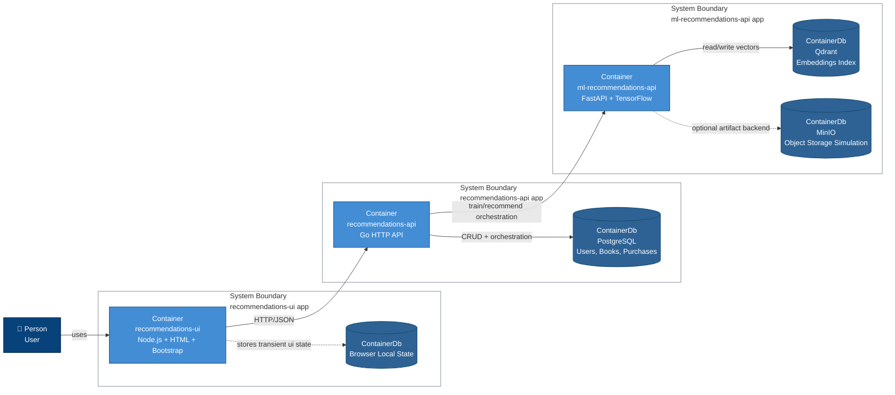

# Book Recommendation System

Distributed book recommendation system with:

- Go API (`recommendations-api`)
- Python ML API + TensorFlow (`ml-recommendations-api`)
- HTML + Node.js UI (`recommendations-ui`)
- PostgreSQL + Qdrant
- MinIO (object storage simulation)
- Docker Compose for local execution

## What is implemented

- User, book, and purchase management.
- Manual model training from current relational data.
- Recommendation ranking based on age, interests, and purchase behavior.
- Recommendation UI with visual cards, score percentage, and explanation signals.
- Qdrant vector indexing with automatic reindex when vector dimensions evolve.

## Run the full stack

```bash
docker compose up --build
```

To recreate data volumes and bootstrap from scratch:

```bash
docker compose down -v
docker compose up --build
```

## Local URLs

- UI: http://localhost:3000
- Recommendations API: http://localhost:8080
- ML Recommendations API: http://localhost:5000
- Qdrant: http://localhost:6333/dashboard
- MinIO API: http://localhost:9000
- MinIO Console: http://localhost:9001

## Initial endpoints

- API health: `GET /health`
- Books: `POST /api/v1/books`, `GET /api/v1/books`
- Users: `POST /api/v1/users`, `GET /api/v1/users`
- Purchases: `POST /api/v1/purchases`, `GET /api/v1/users/{userId}/purchases`
- Recommendations: `GET /api/v1/recommendations/{userId}`
- Manual training trigger: `POST /api/v1/recommendations/train`

## C4 Model (GitHub-renderable)

### Container Diagram



### Current bootstrap status

- Recommendations API persists books, users, and purchases in PostgreSQL.
- ML Recommendations API follows a clean-architecture-inspired structure.
- Initial user/book/purchase seed is loaded from `db/init/002_seed.sql`.
- Encoding context is persisted in `ml-recommendations-api/saved_models/encoding-context.json`.
- Training is manual through `POST /api/v1/recommendations/train`.
- Recommendation flow has two stages:
  1. Qdrant retrieves ANN candidates by vector similarity.
  2. TensorFlow re-ranks candidates with `model.predict` using age and purchase-enriched profile signals.
- On vector dimension mismatch, embeddings are reindexed (resaved) before retrying recommendation.
- UI renders recommendations as cards with score percentage.
- MinIO is included to simulate production-like artifact storage.
- Healthchecks are chained across `postgres -> ml-recommendations-api -> recommendations-api -> recommendations-ui`.

> This bootstrap is a starting point for iterative evolution under SDD.

## Spec-Driven Development (SDD)

Specifications are organized by service and by feature in:

- `docs/sdd/README.md`
- `docs/sdd/services/`
- `docs/sdd/features/`

Use these documents as the official source for new requirements and changes.
`SPEC-BOOK-RECOMMENDATIONS.md` is now an executive index pointing to SDD.
